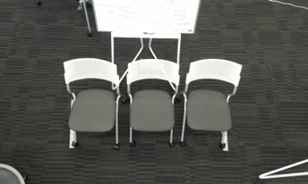
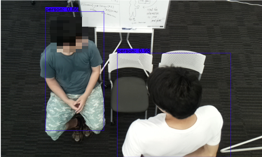
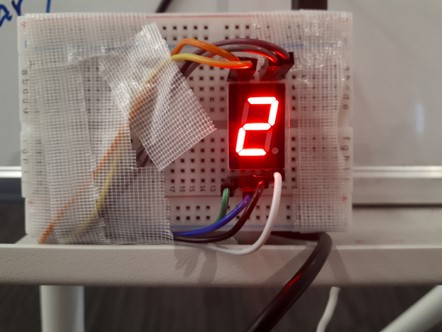
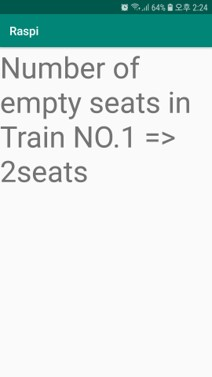
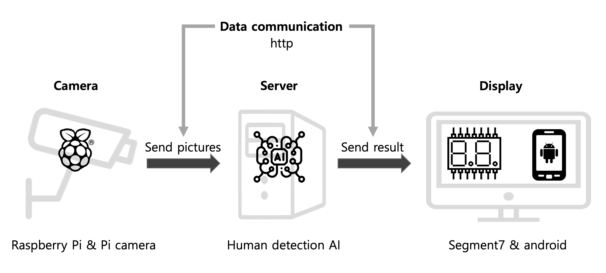

# RaspberryPi

Global PBL project with SIT(Shibaura Institute of Technology, Japan)

From 2019.07.19 to 2019.07.29

지하철 빈 좌석 체크 프로그램

## 프로젝트 개요

지하철의 좌석을 카메라로 촬영해 빈 좌석의 수를 계산하는 시스템을 목적으로 함

1. 카메라로 실시간 지하철 좌석 영상을 촬영하고 서버에 영상을 전송
2. 서버의 영상 처리 AI가 좌석에 앉아 있는 사람을 감지하고 그 수를 계산
3. 미리 입력 받은 해당 지하철 칸의 자리 수에서 앉아 있는 사람의 수를 빼서 빈 좌석을 계산
4. 지하철 외부의 디스플레이와 스마트폰의 안드로이드 앱에 빈 좌석 수를 전송
5. 지하철 외부의 디스플레이를 보고 해당 칸의 빈 좌석 수를 확인 & 안드로이드 앱을 통해 어디서든 원하는 노선의 지하철 칸 별 빈 좌석수 확인

## 프로젝트 구현

프로그램 시연을 위해서 가상의 지하철 칸을 구성

주어진 장비와 장소의 제약으로 인해 좌석은 3개로 고정

영상 내의 사람을 모두 감지한 후에 앉아 있는 사람인지 서 있는 사람인지 판별

미리 입력 받은 총 좌석 수(시연 프로그램에서는 3)에서 앉은 사람의 수를 빼서 빈 좌석의 수를 계산

빈 좌석의 수를 디스플레이와 안드로이드 앱에 전송

## 프로젝트 구성 요소

* Raspberry Pi $$\times$$ 2
* Server
* Camera & Display
* Android
* Wi-fi

## 사용 기술

* Python
* PiCamera(Raspberry Pi의 camera를 위한 python 라이브러리)
* segment7(디스플레이 센서)
* AI using Tensorflow(YOLO algorithm)
* Android Studio
* Flask(python Server)

